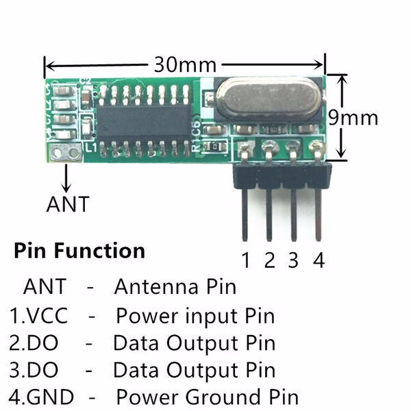
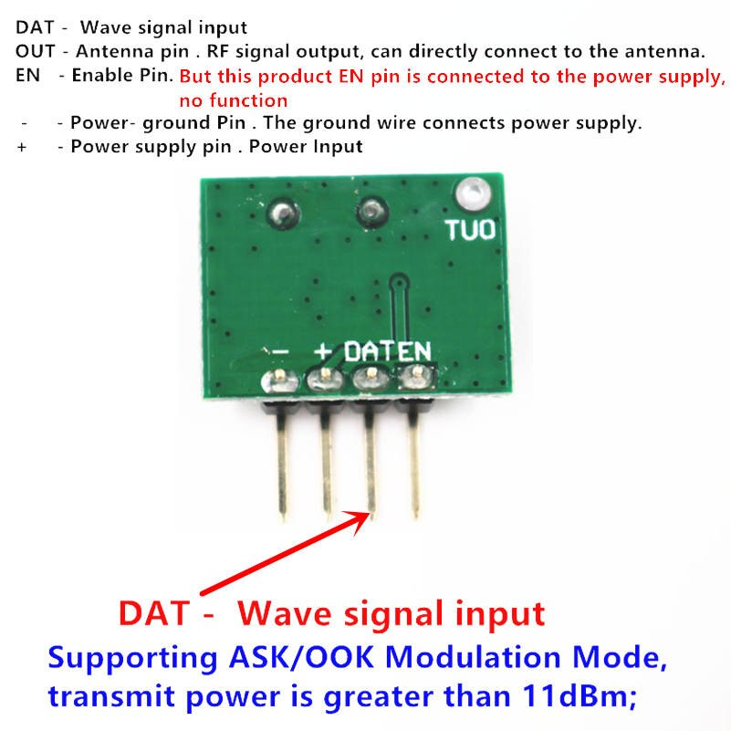

# 433Mhz

Пример использования [радиомодуля на 433Мгц](https://aliexpress.ru/item/32840951211.html).

Модуль используется вот такой:

Без антенн у меня показал работоспособность примерно на расстоянии 10-12 метров. Приёмник был подключён к компьютеру в квартире, передатчик вынесен на улицу.

При этих же условиях, но с антеннами, расстояние составило порядка 40 метров. Передатчик находился в квартире, а приёмник по OTG был подключён к смартфону на улице. Уверен, что расстояние может быть куда больше, если питать не от пинов arduino, а от собственного стабильного источника.
- - -
# Файлы

- [./simple](./simple) - пример простейшего использования модуля.
- [./scaner](./scaner) - пример сканера радиоэфира. Можно использовать для чтения кодов с пульта.

- - -
# Схема подключения приёмника

Питание на приёмник можно подать от самой arduino, либо от внешнего источника. Пин `Data` подключаем к 12 пину arduino.
- - -
# Схема подключения передатчика

Питание на передатчик можно подать от самой arduino, либо от внешнего источника. Пин `Data` подключаем к 12 пину arduino.