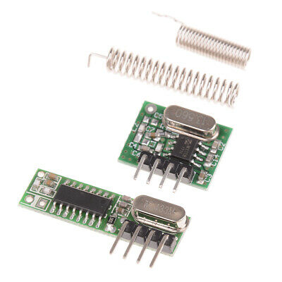
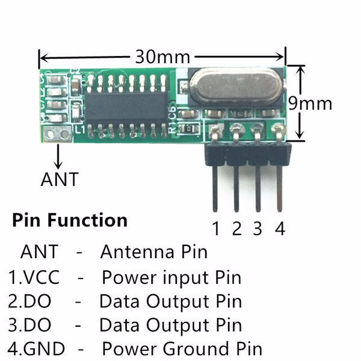
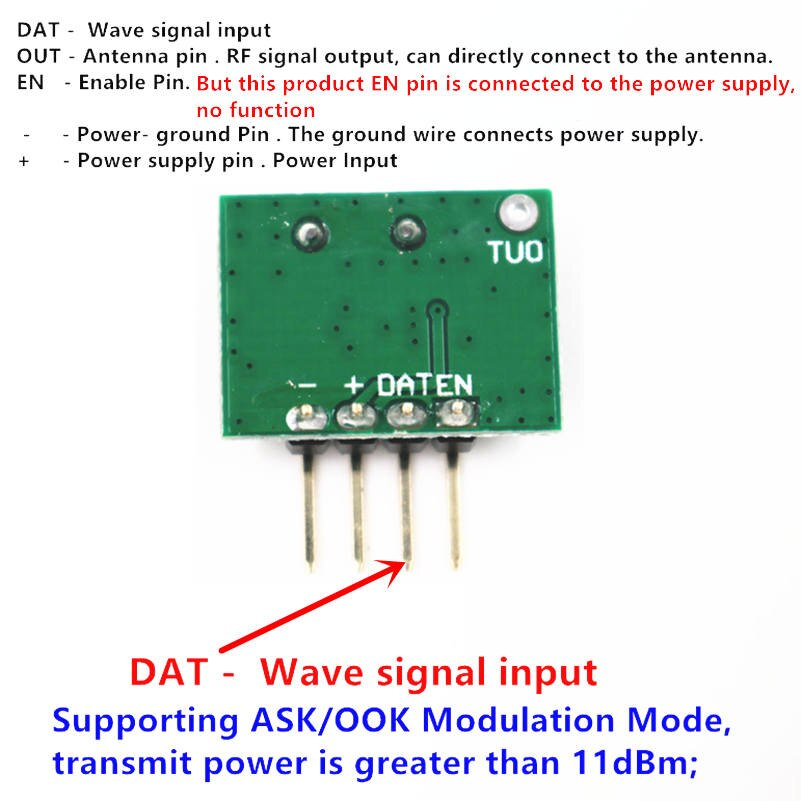

# 433Mhz

Пример использования [радиомодуля на 433Мгц](https://aliexpress.ru/item/32840951211.html).

Модуль используется вот такой:

Без антенн у меня показал работоспособность примерно на расстоянии 10-12 метров. Приёмник был подключён к компьютеру в квартире, передатчик вынесен на улицу.
- - -
# Файлы

- `rx.ino` - скетч для приёмника.
- `tx.ino` - скетч для передатчика.
- - -
# Схема подключения приёмника

Питание на приёмник можно подать от самой arduino, либо от внешнего источника. Пин `Data` подключаем к 12 пину arduino.
- - -
# Схема подключения передатчика

Питание на передатчик можно подать от самой arduino, либо от внешнего источника. Пин `Data` подключаем к 12 пину arduino.